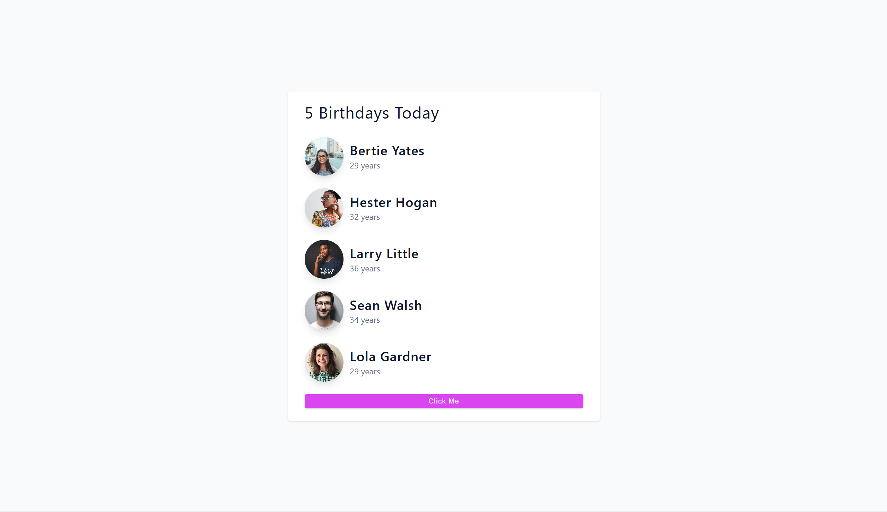

## 🎉 Birthday Reminder App (React)

A simple React app that displays a list of people's birthdays and allows users to clear the list with a single click. Built using functional components and the `useState` hook.

---

### 📸 Preview




---

### ⚙️ Features

- 🧠 Uses `useState` for state management  
- 🗂 Displays a list of birthdays  
- 🧹 "Clear All" button to remove the list  
- 🖼 Renders profile images, names, and ages  
- 📱 Responsive & clean UI with basic CSS

---

### 🚀 Getting Started

#### 1. Clone the repo

```bash
git clone https://github.com/Snapix07/Birthday-buddy.git
cd Birthday-buddy
```

#### 2. Install dependencies

```bash
npm install
```

#### 3. Start the development server

```bash
npm start
```

The app will be available at `http://localhost:3000`.

---

### 📁 Project Structure

```
src/
│
├── App.jsx           # Main component with useState
├── List.jsx          # List component to render Person cards
├── Persons.jsx       # Individual Person component
├── data.js           # Static birthday data
├── index.css         # Basic styling
└── index.js          # Entry point
```

---

### 🧠 useState Example

In `App.jsx`:

```jsx
const [people, setPeople] = useState(data);
```

- Initializes the list of people with data from `data.js`
- When user clicks "Clear All", it calls `setPeople([])` to empty the list

---

### 📦 Dependencies

- React
- Vite or Create React App (CRA)
- CSS

---

### 👨‍💻 Author

Made with ❤️ by Snapix

---

### 📜 License

This project is open source and free to use.
